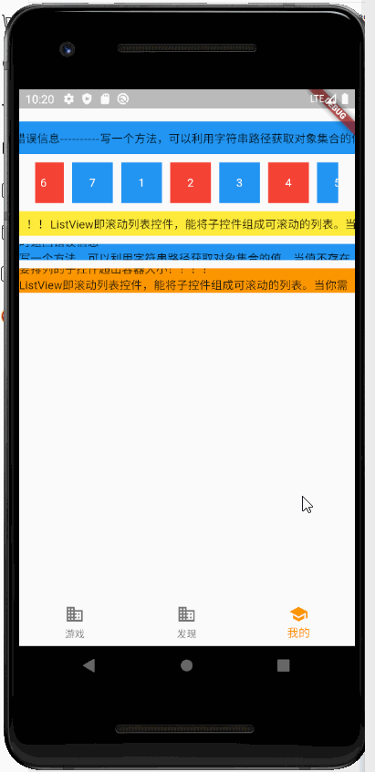

- `ListView` 被`Container`等容器包裹报错
  - 使用扩展小部件`Expanded`包裹`ListView`
### 返回到某一级路由，并销毁中间路由
```dart
/// 比如当前所在路由： A → B → C → D → E → F
/// 需要从 F 返回到 C 并销毁 D、E
Navigator.of(context).popUntil(ModalRoute.withName('C'));
```

### 打包
	- android
		- flutter build apk --release 
### 按钮

```
MaterialButton(
  // 解决存在最小尺寸根据达到自适应
  materialTapTargetSize: MaterialTapTargetSize.shrinkWrap,
  // 去掉padding
  padding: EdgeInsets.all(0),
  // 去掉最小宽度
  minWidth: 0,
  // 去掉最小高度
  height: 0,
  // 圆角 
  shape: RoundedRectangleBorder(
    borderRadius: BorderRadius.all(Radius.circular(50)),
  ),
)
```


### 页面渲染完成回调
```
WidgetsBinding.instance.addPostFrameCallback((mag) {
    // 这里mounted执行操做
});
```

### Text文本溢出，显示...
```
// 需要通过布局，让父容器拥有固定宽度
// 可以固定 width
// 也可以 Flex 布局 套 Expanded
Text(
  '文本类容，假如很长',
  style: TextStyle(
    fontSize: px(36),
    color: Colors.white,
  ),
  softWrap: true,
  overflow: TextOverflow.ellipsis,
  maxLines: 1, // 最大行数
)
```


### 隐藏手机状态栏
```
SystemChrome.setEnabledSystemUIOverlays([]);
```

### 修改android AVD 默认位置
- 默认位置为：`C:\Users\{{account}}\.android\avd`
- 修改到其他盘符。比如D盘：
    - 在D盘新建一个目录 `D:\AndroidAVD`（模拟器不会自动创建该文件夹）
    - 添加环境变量 `ANDROID_SDK_HOME` => 值为 => `D:\AndroidAVD`
    - 重启计算机
    - 再新建AVD时，目录就到刚刚添加的盘符了
### 真机闪退

```
// 可能是打包混淆造成的，可尝试关闭混淆
// 修改`{{appPath}}/android/app/build.gradle` 文件
buildTypes {
	release {
		minifyEnabled false
		shrinkResources false
	}
}
```

#### 无缝滚动

```
// 导入类
import './BestimeDart/InfiniteScroll.dart';

// 使用
InfiniteScroll(
  maskLeft: '#444',
  maskRight: '#444',
  child: Text(
    '这是一个无限滚动公告，如果内容不超过父容器，将不会进行滚动......'
  ),
  size: 40,
  speed: 30,
  period: 1000
)
```